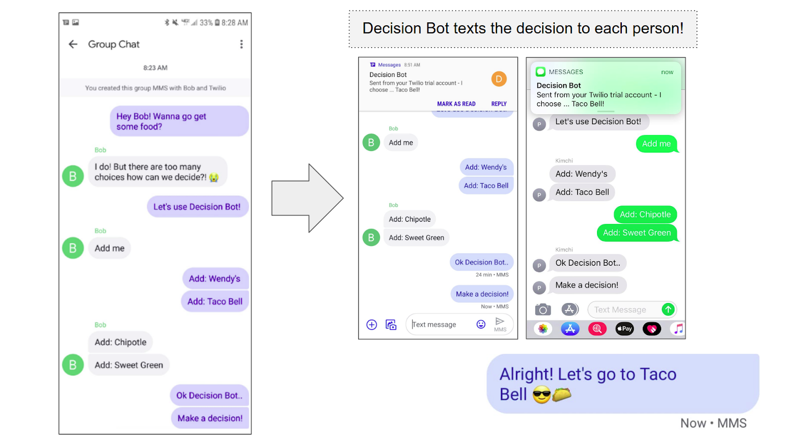

# Group Chat Decision Bot


<p align="center">

</p>
How many times have you tried to make plans in the group chat but no one could agree on one thing? :'(
Don't waste your time, let our Decision Bot decide!

Decide alone or with friends!


## Requires
* A Twilio Account
* ngrok
* A Phone

## Setup

1. Clone the repository and install the ```requirements.txt``` dependencies.
2. Run ```./ngrok http 5000``` (or whichever port your web application will run on)
3. Copy your ngrok url and paste that into your Twilio Number's webhook form. Add "/sms" to the end of this url.
4. Store your Twilio credentials and phone number using environment variables
```
export TWILIO_SID=999999999999999999999999 
```
5. Run your app with ```python3 app.py```

## How to use Decision Bot

1. Add Decision Bot to your group chat.
2. Have your friends text ```Add me``` to add themselves the group!

### Decide in 2 different ways!
* Send a text in the following format and Decision Bot will automatically choose (Send up to 9 choices!)
```
Help me decide!
1. Option 1
2. Option 2
3. Option 3
......

```
* <b>OR</b> you and your friends can add options manually by sending ```Add: {option}```.
When you're reading for Decision Bot to make a decision, tell him ```Make a decision!```

4. Decision box will send a text message to each person in the group with the decision he chooses!
5. Send ```Deactivate``` to stop receiving decision messages or just remove Decision Bot from the group.



